<!-- Improved compatibility of back to top link: See: https://github.com/othneildrew/Best-README-Template/pull/73 -->
<a name="readme-top" id="readme-top"></a>
<!--
*** Thanks for checking out the Best-README-Template. If you have a suggestion
*** that would make this better, please fork the repo and create a pull request
*** or simply open an issue with the tag "enhancement".
*** Don't forget to give the project a star!
*** Thanks again! Now go create something AMAZING! :D
-->


<!-- PROJECT SHIELDS -->
<!--
*** I'm using markdown "reference style" links for readability.
*** Reference links are enclosed in brackets [ ] instead of parentheses ( ).
*** See the bottom of this document for the declaration of the reference variables
*** for contributors-url, forks-url, etc. This is an optional, concise syntax you may use.
*** https://www.markdownguide.org/basic-syntax/#reference-style-links
-->
[![GitHub][github-shield]][github-url]
[![LinkedIn][linkedin-shield]][linkedin-url]


<!-- PROJECT LOGO -->
<br />
<div align="center">
  <a href="https://coderhousejakefernandezproject.netlify.app">
    
  </a>

  <h3 align="center">CoderHouse Final Vanilla JavaScript Project</h3>

  <p align="center">
    Let me introduce you to Mon-Key Restaurant!
    <br />
    <a href="https://github.com/jakefernandez102/CoderHouse-React-Vite-Project"><strong>Explore the repocitory »</strong></a>
    <br />
    <br />
    <a href="https://coderhousejakefernandezproject.netlify.app">View Demo</a>
  </p>
</div>


<!-- TABLE OF CONTENTS -->
<details>
  <summary>Table of Contents</summary>
  <ol>
    <li>
      <a href="#about-the-project">About The Project</a>
      <ul>
        <li><a href="#built-with">Built With</a></li>
      </ul>
    </li>
    <li>
      <a href="#getting-started">Getting Started</a>
      <ul>
        <li><a href="#prerequisites">Prerequisites</a></li>
        <li><a href="#installation">Installation</a></li>
      </ul>
    </li>
    <li><a href="#usage">Usage</a></li>
    <li><a href="#roadmap">Roadmap</a></li>
    <li><a href="#contributing">Contributing</a></li>
    <li><a href="#license">License</a></li>
    <li><a href="#contact">Contact</a></li>
    <li><a href="#acknowledgments">Acknowledgments</a></li>
  </ol>
</details>


<!-- ABOUT THE PROJECT -->
## About The Project

<div align="center">
  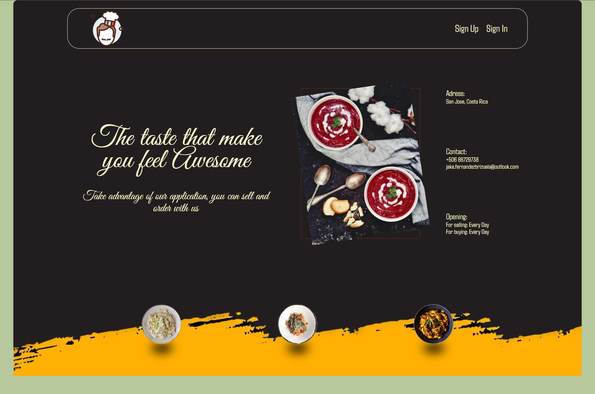
</div>


JK'Store is a simulation of an application where you will be able to register as seller of products or as a buyer to buy all the products that sellers add to their virtual restaurants.

<p align="right">(<a href="#readme-top">back to top</a>)</p>


### Built With

This section should list any major frameworks/libraries used to bootstrap your project. Leave any add-ons/plugins for the acknowledgements section. Here are a few examples.


* [![JavaScript][Javascript.js]][Javascript.js]
* [![Bootstrap][Bootstrap.com]][Bootstrap-url]
* [![Gulp][gulp.com]][gulp.com]


<p align="right">(<a href="#readme-top">back to top</a>)</p>


<!-- GETTING STARTED -->
## Getting Started

This is a little guide of how you may give instructions on setting up your project locally.
To get a local copy up and running follow these simple steps.

### Prerequisites

This is how to list things you need to use the software and how to install them.
* npm
  ```sh
  npm install npm@latest -g
  ```

### Installation

Below you will read how you can install and set up this app.

1. Clone the repo
   ```sh
   git clone https://github.com/jakefernandez102/CoderHouse-JS-Project
   ```
3. Install NPM packages
   ```sh
   npm install
   ```

4. Now you can go to the console prompt and execute the command
   ```cmd
    npm run dev
   ```

<p align="right">(<a href="#readme-top">back to top</a>)</p>


<!-- USAGE EXAMPLES -->
## Usage

1. You will see a simple layout with a nice slogan, where you will be able to register by clicking the SignUp button or SigIn by clicking the SignIn button

<div align="center">
  
</div>

<br/>

2. To register you have to introduce your full name, phone number, select what do you want to do in our web application, your email, and password to login.
<div align="center">
  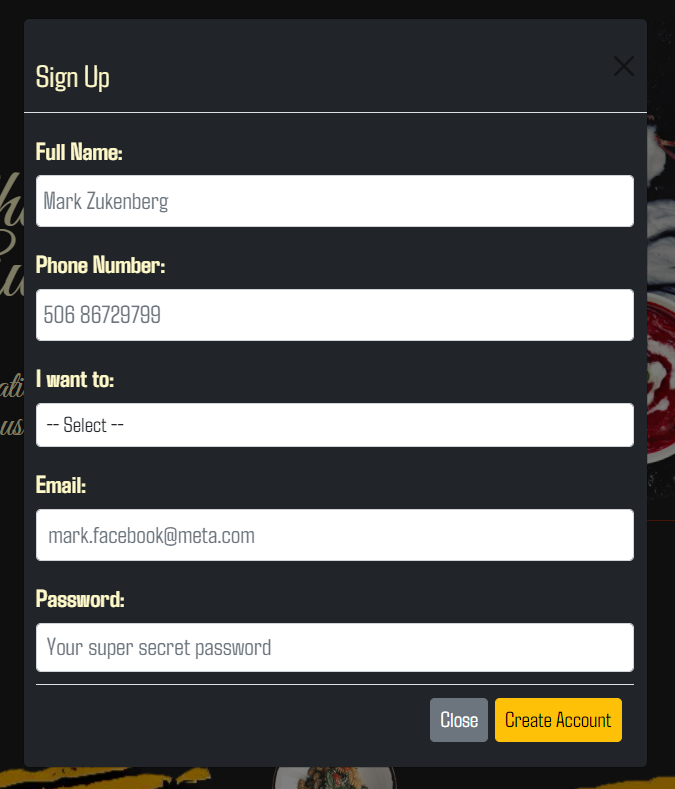
</div>

<br/>

3. Then you can signIn by providing the email and password you've used to register.
<div align="center">
  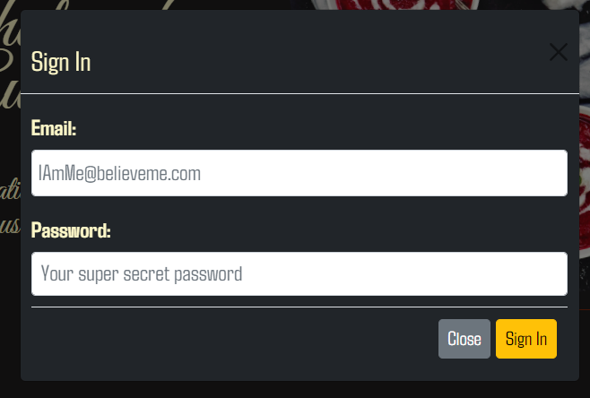
</div>

<br/>

At the seller dashboard, you will see two options, the restaurant module where you'll be able to add restaurants and products to different restaurant you've added/
<div align="center">
  
</div>
<br/>

4. Restaurant Module you have two options: 
<div align="center">
  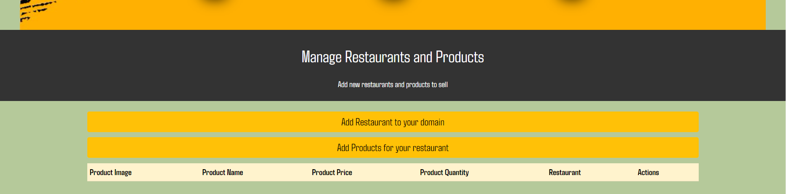
</div>

 <br/>

5. To add a product you have to add a restaurante name.
<div align="center">
  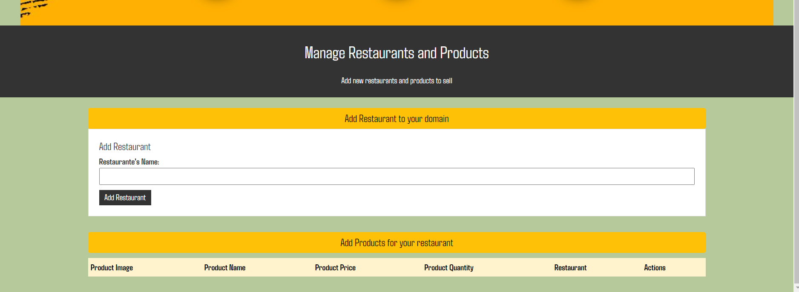
</div>
<br/>

6. then you will be able to add a product to the restaurant that you choose. You can add the product with the details just like in the following image.
<div align="center">
  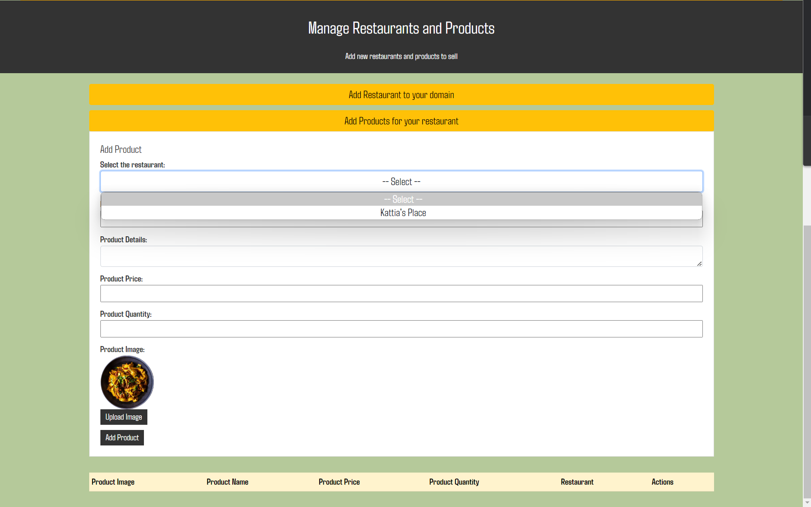
</div>
<br/>

7. In the Home module, you will see the summary of all the people that have bought in your restaurants.
<div align="center">
  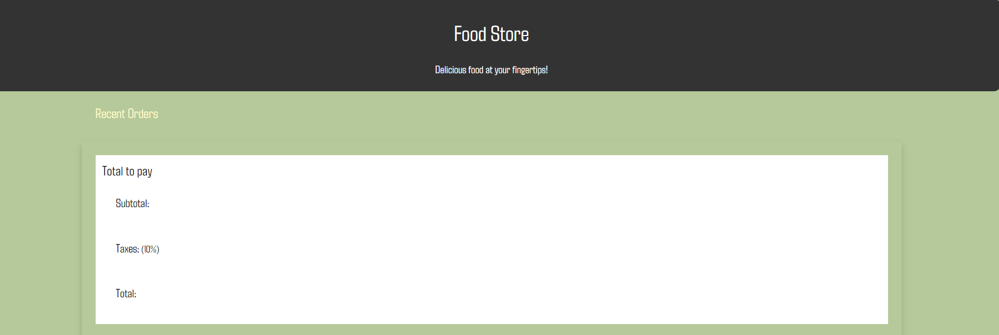
</div>
<br/>

8. If you register as a Buyer. like in the following image
<div align="center">
  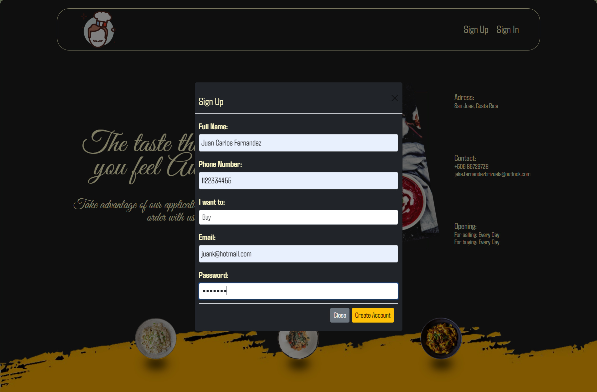
</div>
<br/>

9. You will be able to see three options, "Food Store", "Home", "Cart Icon". You will be able to buy the products that the sellers add in the Food Store module.
<div align="center">
  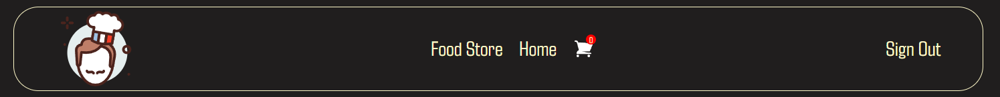
</div>
<br/>

10. As you can see here will be displayed the products of each restaurant that has been created before by the different sellers
<div align="center">
  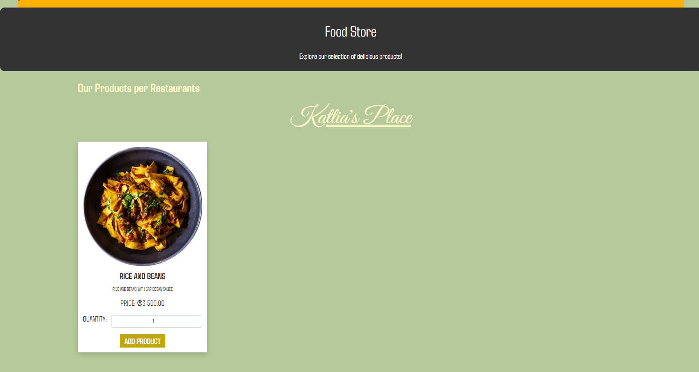
</div>
<br/>

11. Once you click on Add Product button you will see a alert or flag at the top-right of the screen letting you know that the product has been added successfully to the cart.
<div align="center">
  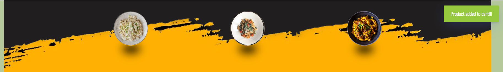
</div>
<br/>

12. If you click the Cart Icon, you will see the list of products that you have added before.
<div align="center">
  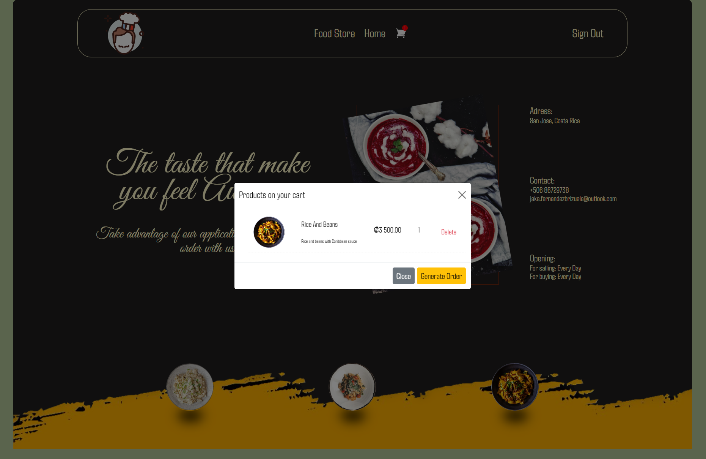
</div>
<br/>

13. and finally the Home module is kind the same of the Seller's Home, a summary of products you've bought.
<div align="center">
  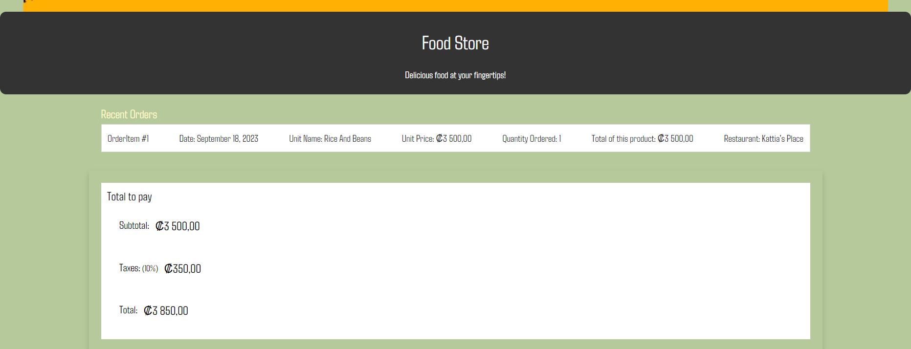
</div>

<p align="right">(<a href="#readme-top">back to top</a>)</p>


<!-- ROADMAP -->
## Roadmap

- [x] Auth
- [x] List Product
- [x] Add Product to Cart
- [x] CRUD functionality
- [x] Cloudinary for storage the images
    - [x] Read
    - [x] Write


<p align="right">(<a href="#readme-top">back to top</a>)</p>


<!-- CONTACT -->
## Contact

Jake Fernandez Brizuela - [Jake Fernandez Brizuela](https://www.linkedin.com/in/jake-fernandez-brizuela-73572222a/) - jake.fernandezbrizuela@outlook.com

Project Link: [https://github.com/jakefernandez102/CoderHouse-React-Vite-Project](https://github.com/jakefernandez102/CoderHouse-React-Vite-Project)

Portfolio: [https://portfoliojakefernandez.netlify.app](https://portfoliojakefernandez.netlify.app)

<p align="right">(<a href="#readme-top">back to top</a>)</p>


<!-- ACKNOWLEDGMENTS -->
## Acknowledgments

* [GitHub Emoji Cheat Sheet](https://www.webpagefx.com/tools/emoji-cheat-sheet)
* [Img Shields](https://shields.io)
* [GitHub Pages](https://pages.github.com)
* [HeroIcons](https://heroicons.com)

<p align="right">(<a href="#readme-top">back to top</a>)</p>


<!-- MARKDOWN LINKS & IMAGES -->
<!-- https://www.markdownguide.org/basic-syntax/#reference-style-links -->
[contributors-shield]: https://img.shields.io/github/contributors/othneildrew/Best-README-Template.svg?style=for-the-badge
[contributors-url]: https://github.com/othneildrew/Best-README-Template/graphs/contributors
[forks-shield]: https://img.shields.io/github/forks/othneildrew/Best-README-Template.svg?style=for-the-badge
[forks-url]: https://github.com/othneildrew/Best-README-Template/network/members
[stars-shield]: https://img.shields.io/github/stars/othneildrew/Best-README-Template.svg?style=for-the-badge
[stars-url]: https://github.com/othneildrew/Best-README-Template/stargazers
[issues-shield]: https://img.shields.io/github/issues/othneildrew/Best-README-Template.svg?style=for-the-badge
[issues-url]: https://github.com/othneildrew/Best-README-Template/issues
[license-shield]: https://img.shields.io/github/license/othneildrew/Best-README-Template.svg?style=for-the-badge
[license-url]: https://github.com/othneildrew/Best-README-Template/blob/master/LICENSE.txt
[linkedin-shield]: https://img.shields.io/badge/-LinkedIn-black.svg?style=for-the-badge&logo=linkedin&colorB=555
[github-shield]: https://img.shields.io/badge/-GitHub-black.svg?style=for-the-badge&logo=github&colorB=555
[linkedin-url]: https://www.linkedin.com/in/jake-fernandez-brizuela-73572222a/
[github-url]: https://github.com/jakefernandez102
[product-screenshot]: ./public/img/Screenshot-site.png
[Javascript.js]: https://img.shields.io/badge/javascript-%23323330.svg?style=for-the-badge&logo=javascript&logoColor=%23F7DF1E
[Bootstrap.com]: https://img.shields.io/badge/bootstrap-%238511FA.svg?style=for-the-badge&logo=bootstrap&logoColor=white
[Bootstrap-url]: https://getbootstrap.com
[gulp.com]: https://img.shields.io/badge/GULP-%23CF4647.svg?style=for-the-badge&logo=gulp&logoColor=white

